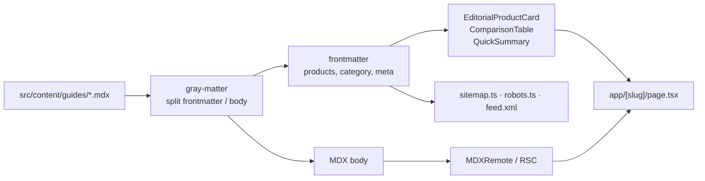

<p align="center">
  
  
  
  
  
</p>

An affiliate review site built the way a publisher would build it: content is files, not
rows in a CMS; every buying guide is an MDX document whose frontmatter drives the
product cards, comparison tables and structured metadata on the page.

> [!WARNING]
> **This repo does not build as-is.** `src/lib/content.ts` reads guides from
> `src/content/guides/`, and that directory is not committed — `fs.readdirSync` throws on
> a missing path. Add at least one `.mdx` guide there before running `next build`.
> See [Adding a guide](#adding-a-guide).

## How content becomes a page

One MDX file per buying guide. Frontmatter carries the product data; the body carries the
editorial. Nothing is fetched at request time, so every route is static and fast.



## What is actually built here

Most affiliate templates stop at a product grid. The parts that took real work:

| Area | What exists |
| :-- | :-- |
| Content pipeline | MDX + gray-matter, rendered through `MDXRemote` as a React Server Component |
| Product model | A 69-field `ProductItem` type — pros, cons, price class, badges, colours, ASIN |
| Comparison | `ComparisonTable` renders any product set side by side |
| Discovery | `SearchModal`, `GuideGridFilter`, category routes at `categories/[slug]` |
| Reading experience | `TableOfContents`, `Breadcrumbs`, `AuthorCard`, `FAQAccordion` |
| Syndication | Generated `sitemap.ts`, `robots.ts` and a real RSS feed at `feed.xml/route.ts` |
| Disclosure | `AffiliateDisclosure` plus standalone editorial-ethics and privacy routes |
| Social | Pinterest save button and grid, Instagram-style gallery |

The disclosure and editorial-ethics pages are not decoration — affiliate sites are
required to disclose paid links, and having them as first-class routes is the difference
between a real publication and a spam farm.

## Running it

```bash
npm install && npm run dev
```

Next.js 15, App Router, TypeScript. Remote images are allow-listed in `next.config.ts` —
add any new image host there or `next/image` will refuse to load it.

## Adding a guide

Create `src/content/guides/my-guide.mdx`:

```mdx
---
title: "Best Reading Lamps for Small Apartments"
category: "home"
products:
  - name: "Example Lamp"
    brand: "Example"
    asin: "B000000000"
    priceClass: "$$"
    imageUrl: "https://images.unsplash.com/..."
    summary: "One line on who it suits."
    pros: ["Bright", "Quiet dimmer"]
    cons: ["Short cable"]
---

Editorial copy goes here. Product cards render from the frontmatter above.
```

The slug is the filename. `sitemap.ts` and `feed.xml` pick it up automatically.

## Configuration

| File | Controls |
| :-- | :-- |
| `src/config/site.ts` | Site name, tagline, description, author |
| `src/config/affiliate.ts` | Affiliate tag and link construction |
| `next.config.ts` | Allowed remote image hosts |

## Screenshots

_Drop images into `docs/screenshots/` and reference them here — a guide page with the
comparison table open is the one that sells this project._

## Licence

No licence file yet. Until one is added, default copyright applies.
